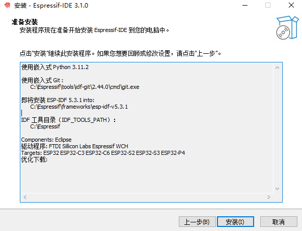
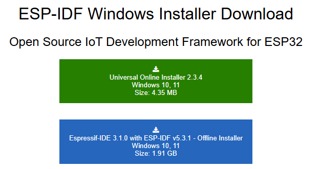
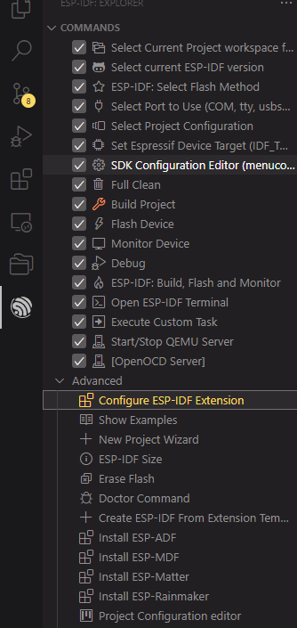
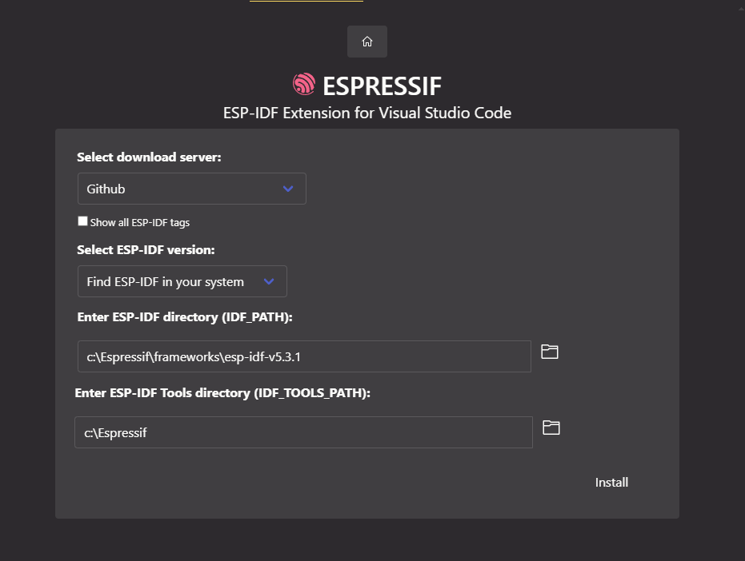

从 [这里](https://dl.espressif.cn/dl/esp-idf/) 安装 IDE



下载 vscode 插件


配置插件

- 双击 Configure ESP-IDF Extension，进入配置界面





如果提示pip报错，可以在对应目录中运行：

```shell
C:\Espressif\tools\idf-python\3.11.2\python.exe -m ensurepip
```

从而保证 pip 存在
