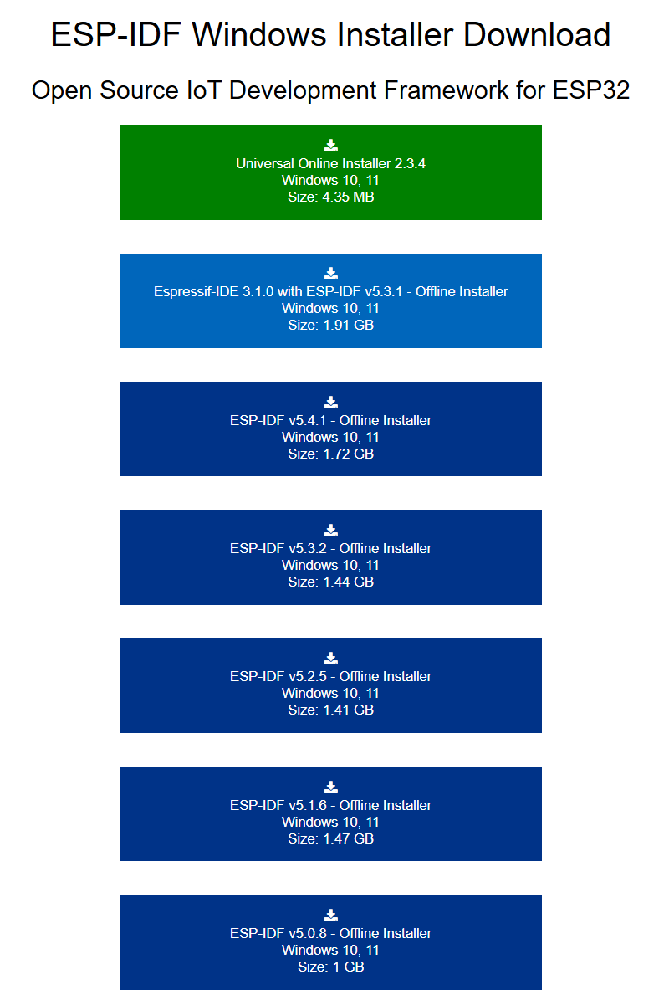
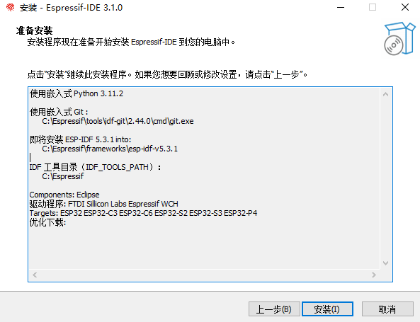

从 [这里](https://dl.espressif.cn/dl/esp-idf/) 安装 IDE

点击 Universal Online Installer 2.3.4，使用安装器



使用默认配置即可，一直点击「下一步」，最后确认界面如下图所示，点击「安装」，为了统一开发环境，请确认安装的 IDE 版本为 5.4.1




如果采取了上图的默认配置选项，那么

| 名称                                     | 路径                                   |
| ---------------------------------------- | -------------------------------------- |
| ESP-IDF directory (IDF_PATH)             | C:\Espressif\frameworks\esp-idf-v5.4.1 |
| ESP-IDF Tools directory (IDF_TOOLS_PATH) | C:\Espressif                           |

下载 vscode 插件


配置插件

- 双击 Configure ESP-IDF Extension，进入配置界面


如下图，如果在配置过程中提示 pip 报错：


可以利用命令行执行以下命令，从而保证 pip 存在：

```shell
C:\Espressif\tools\idf-python\3.11.2\python.exe -m ensurepip
```

## References

[ESP32C5 官方文档](https://docs.espressif.com/projects/esp-idf/en/latest/esp32c5/api-guides/tools/idf-tools.html#idf-tools-uninstall)
