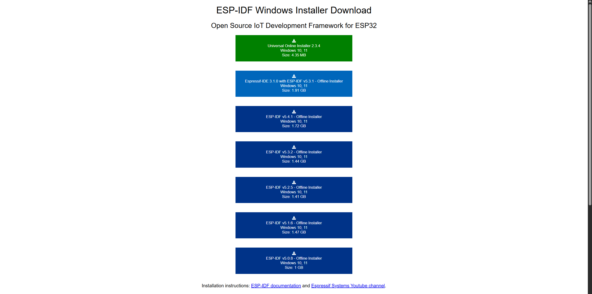
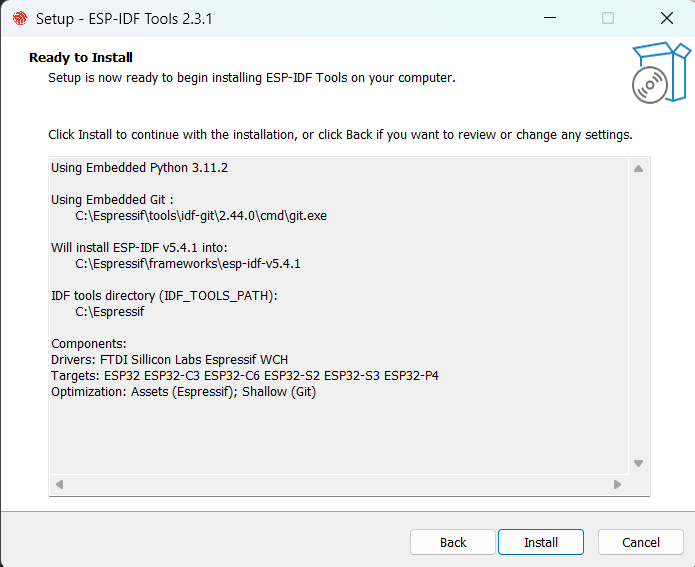
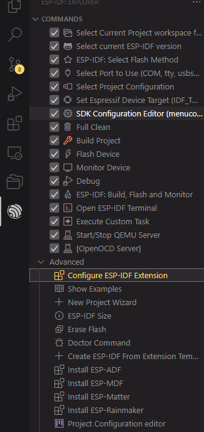
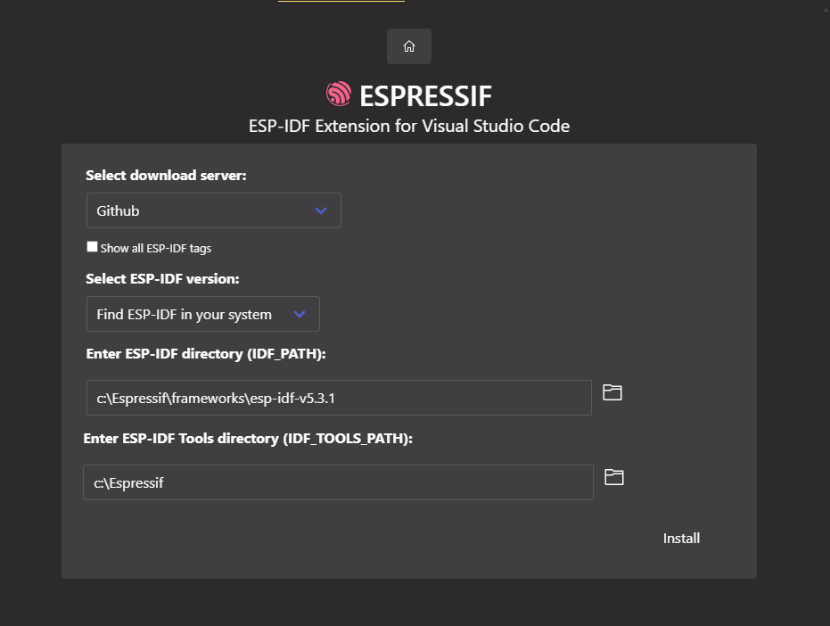
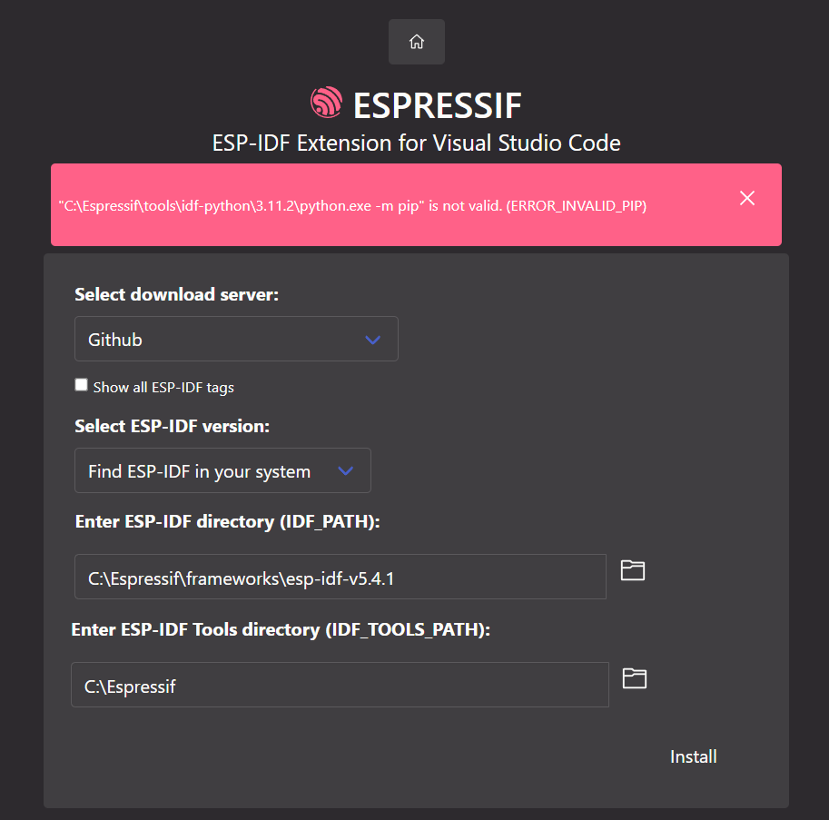
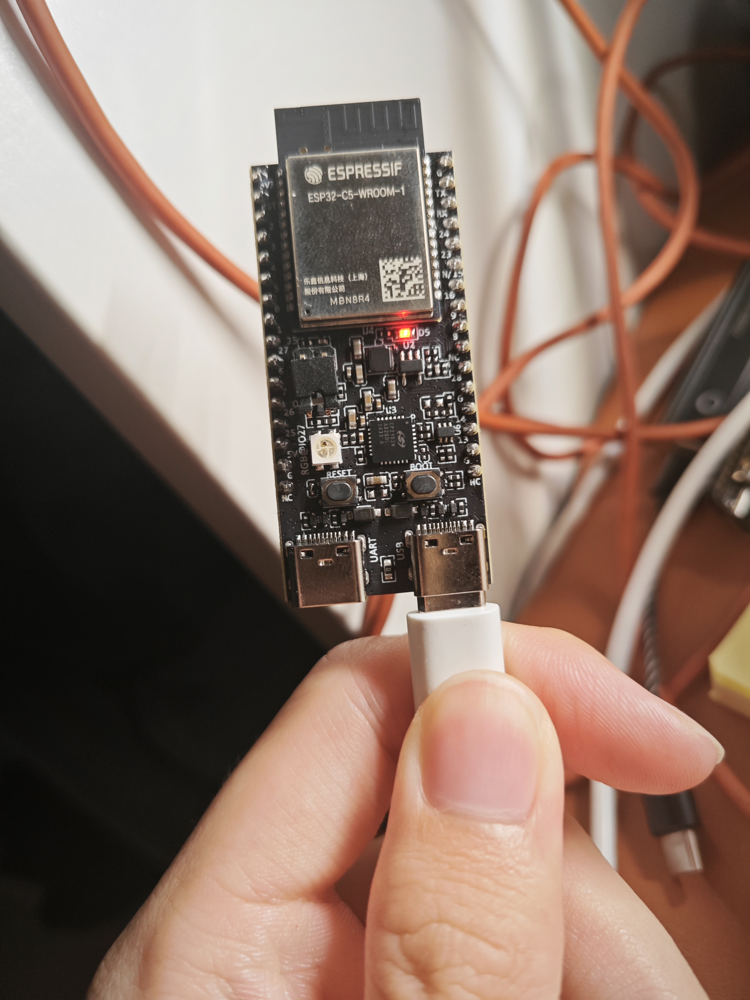
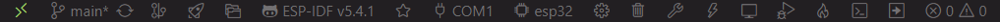
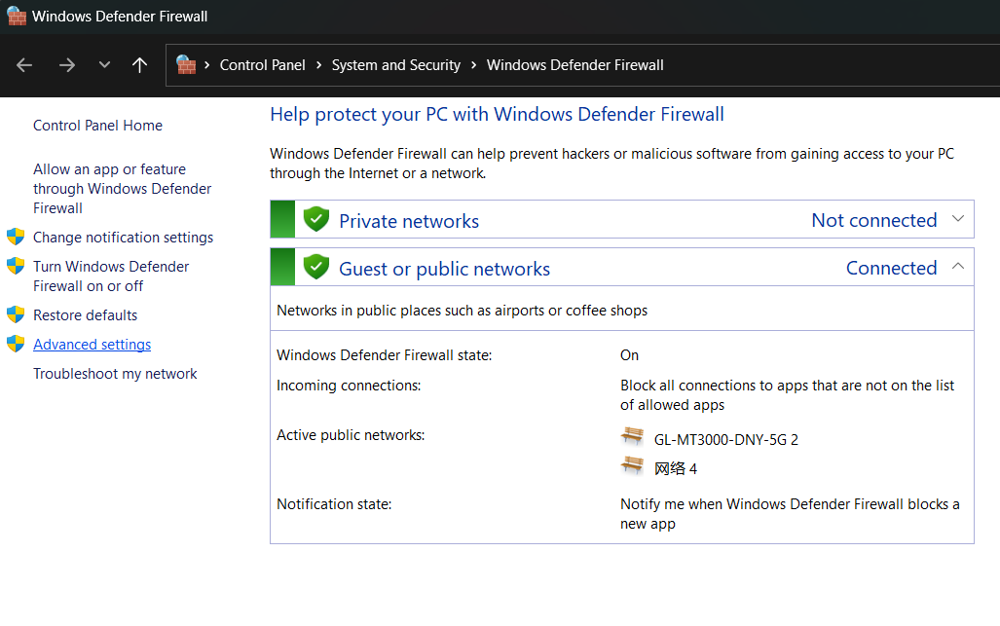
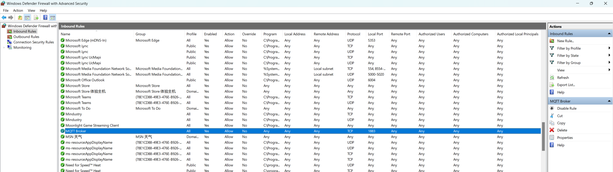

## IDE 安装

> 当前教程仅包含手动安装的步骤，如果需要从插件安装，请参阅其他教程

访问[链接](https://dl.espressif.cn/dl/esp-idf/)



点击 Universal Online Installer 2.3.4，使用安装器

使用默认配置即可，一直点击「下一步」，最后确认界面如下图所示，点击「安装」，为了统一开发环境，请确认安装的 IDE 版本为 5.4.1



如果采取了上图的默认配置选项，那么

| 名称                                     | 路径                                   |
| ---------------------------------------- | -------------------------------------- |
| ESP-IDF directory (IDF_PATH)             | C:\Espressif\frameworks\esp-idf-v5.4.1 |
| ESP-IDF Tools directory (IDF_TOOLS_PATH) | C:\Espressif                           |

## 插件配置

安装 vscode 插件


配置插件

- 双击 Configure ESP-IDF Extension，进入配置界面





如下图，如果在配置过程中提示 pip 报错：



可以利用命令行执行以下命令，从而保证 pip 存在：

```shell
C:\Espressif\tools\idf-python\3.11.2\python.exe -m ensurepip
```

## 编译和烧录

### 接线



### 编译

使用 vscode 打开 `comp7310_2025_group_project\esp32c5\csi_recv` 或者 `comp7310_2025_group_project\esp32c5\csi_send` 目录

在下方工具栏位中点击扳手图标编译，编译完成后可以通过闪电图标烧录

如果弹出配置界面，请注意，flashType 选择 UART (串口), COM 口要选对



## MQTT

### 下载

https://mosquitto.org/download/

### 配置 broker

编辑 `C:\Program Files\mosquitto\mosquitto.conf`
添加下面内容

```plaintext
listener 1883
allow_anonymous true
```

### 配置防火墙





### 开启服务

在有管理员权限的 cmd 中开启 / 关闭 mosquito broker

```shell
net stop mosquitto
net start mosquitto
```

### 验证

通过下方命令，检查监听端口是否存在

```shell
netstat -a
```

### 测试

- 打开一个 cmd，建立一个用本机作为 broker 的 subscriber，关注 `esp32/csi` 下的信息，使用 verbose ouput

```shell
"C:\Program Files\mosquitto\mosquitto_sub" -h localhost -t "esp32/csi" -v
```

### 找到本机 IP

```shell
ipconfig
```

TCP 127.0.0.1:1883

## 参考链接

[ESP32C5 官方文档](https://docs.espressif.com/projects/esp-idf/en/latest/esp32c5/api-guides/tools/idf-tools.html#idf-tools-uninstall)
